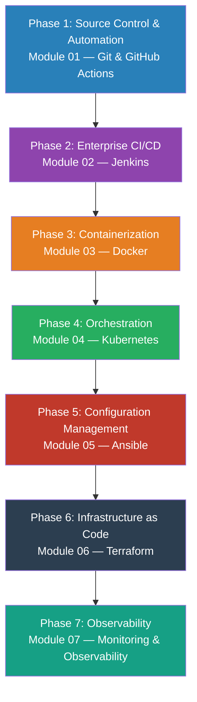

# The DevOps Architect's Path — From Junior Engineer to Senior DevOps Architect

> A structured, production-grounded study repository for engineers who want to
> stop running commands that merely *work* and start designing pipelines, platforms,
> and infrastructure that **scale, survive failure, and stay maintainable**.
>
> **Stack:** Git · GitHub Actions · Jenkins · Docker · Kubernetes · Ansible · Terraform

---

## 1. Who This Is For

You are a competent engineer. You can write a Dockerfile, deploy to a server, and
set up a basic CI pipeline. The gap between you and a Senior DevOps Architect is
**not** more commands — it is *judgment under constraints*: pipeline reliability,
blast radius of infrastructure changes, container security, cluster capacity
planning, and automation that teams trust at 3 AM.

This repository is the deliberate-practice curriculum to close that gap. It is
organized around **seven pillars**, each treated the way a Principal DevOps
Architect treats an incident or a design review: *what is the theory, what does
production code look like, and what will a senior hire interview (or a production
outage) ask of you?*


---

## 2. How to Use This Repository

Each topic directory is **self-contained** and follows an identical contract.
Learn to expect the same shape everywhere — that consistency is itself an
architectural lesson.

| File | Purpose | How to consume it |
|---|---|---|
| `*_mental_models.ipynb` | The main ultra-elaborate notebook: WHY → WHAT → HOW → WHEN. Mental models, diagrams, before/after code, real-world scenarios. | Read it slowly. Run every cell. Break things intentionally. |
| `examples/` | Deep-dive notebooks on individual sub-topics. One file = one concept. | Study one per day. Explain it back without notes. |
| `architectural_notes.md` | The "why behind the why": production trade-offs, failure modes, when NOT to use the approach. | Read after the notebook. This is where senior thinking lives. |
| `interview_questions.md` | Staff/Principal-level questions with model answers and follow-up traps. | Answer out loud *before* reading the model answer. |

**Recommended cadence:** one module per week.  
Read notebook → study examples → run code → answer interview questions from memory → implement your own variation.

---

## 3. The Curriculum Modules (01–07)

| # | Pillar | Directory | Core Question It Answers |
|---|---|---|---|
| 01 | **Git & GitHub Actions** | [`01-git-github-actions/`](./01-git-github-actions/) | *How do I version, collaborate, and automate code safely at scale?* |
| 02 | **Jenkins** | [`02-jenkins/`](./02-jenkins/) | *How do I build enterprise-grade CI/CD pipelines that survive team growth?* |
| 03 | **Docker** | [`03-docker/`](./03-docker/) | *How do I package software so it runs identically everywhere, forever?* |
| 04 | **Kubernetes** | [`04-kubernetes/`](./04-kubernetes/) | *How do I run hundreds of containers reliably across a fleet of machines?* |
| 05 | **Ansible** | [`05-ansible/`](./05-ansible/) | *How do I configure thousands of servers without SSH-ing into each one?* |
| 06 | **Terraform** | [`06-terraform/`](./06-terraform/) | *How do I declare infrastructure so it is reproducible, reviewable, and versioned?* |
| 07 | **Monitoring & Observability** | [`07-monitoring-observability/`](./07-monitoring-observability/) | *When the system breaks at 3 AM, can I see why in under 5 minutes?* |

---

## 4. The Full Learning Path



### The Senior Architect Mental Stack

At the end of this curriculum, every design decision you make will flow through this lens:

| Question | Tool That Answers It |
|---|---|
| How does this code reach production safely? | Git flow + GitHub Actions / Jenkins |
| Where does the artifact live and how is it portable? | Docker image + registry |
| How do I run it reliably at scale? | Kubernetes |
| How do I configure the OS and middleware? | Ansible |
| How do I provision the cloud infrastructure itself? | Terraform |
| How do I know when it breaks? | Prometheus + Grafana + ELK |

---

## 5. Prerequisites

```bash
# Local tooling needed to run all examples
git --version           # >= 2.40
docker --version        # >= 24.0
kubectl version         # >= 1.28
ansible --version       # >= 2.15
terraform --version     # >= 1.6
python --version        # >= 3.11
```

---

## 6. The 10 Commandments of a DevOps Architect

1. **Everything is code.** Infrastructure, config, pipelines, runbooks — version them.
2. **Automate the blast radius.** If a human must remember a step, it will be forgotten.
3. **Design for failure.** Every component will fail. Design so the system doesn't.
4. **Immutable > mutable.** Rebuild containers/VMs rather than patching in place.
5. **Fast feedback loops.** A 45-minute pipeline is a slow compiler — engineers stop fixing tests.
6. **Least privilege everywhere.** The container, the pipeline, the service account.
7. **Observable from day one.** Logs, metrics, traces are not added later — they are the design.
8. **The deployment is not the end.** Rollback, canary, and runbook are part of the feature.
9. **Blast radius before blast-off.** How bad can it get? Can you limit it? Can you recover?
10. **Document the why, not the what.** Code shows the what. Architecture notes show the why.
